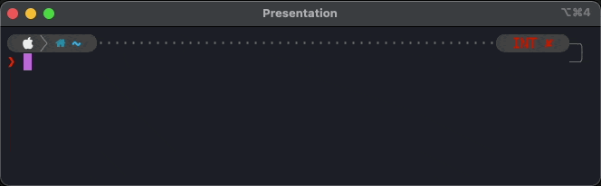

# hs - Human to Shell Translator

A command-line tool that translates human expressions into shell commands using the Anthropic API and Open AI API.

## Features

- Translates natural language descriptions into bash commands
- Shell integration for bash and zsh
- Direct command-line usage

## AI integrations

- anthropic
- openai

## Plugins

See [shell integrations](shell_integrations)

## Demo

Demo using the ZSH plugin that translate human expressions into shell commands when CTRL+H is pressed:

